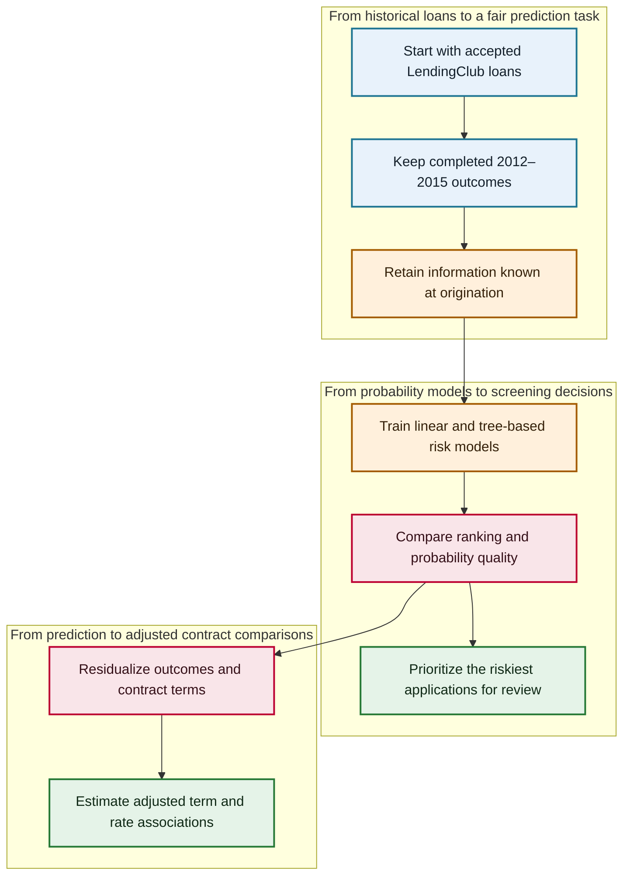

# Risk at First Sight: LendingClub Default-Risk Prediction and Origination Screening

<div align="center">

**Leakage-aware credit-risk modelling with operational screening curves and a Double Machine Learning extension**

[](https://www.r-project.org/)
[](#predictive-models)
[](#screening-as-a-decision-problem)
[](#data-and-cohort-construction)
[](LICENSE)

**[Read the report](report/risk-at-first-sight-report.pdf)** · **[Inspect the R analysis](src/risk_at_first_sight.R)** · **[Prepare the data](data/README.md)**

Original academic project title: **Risk at First Sight**

</div>

**Risk at First Sight** develops an end-to-end view of consumer-credit screening: begin with the information available when a loan is issued, estimate future default risk without post-origination leakage, compare statistical and machine-learning classifiers on one held-out test set, and translate their scores into the practical question of which applications should be reviewed first.

This README is the project's information hub. The [final report](report/risk-at-first-sight-report.pdf) contains the full literature review, derivations, figures, tables, references, implementation appendix, and extended economic discussion.

## Contents

- [Project at a glance](#project-at-a-glance)
- [Research question](#research-question)
- [Project pipeline](#project-pipeline)
- [Data and cohort construction](#data-and-cohort-construction)
- [Leakage-aware feature design](#leakage-aware-feature-design)
- [Predictive models](#predictive-models)
- [Screening as a decision problem](#screening-as-a-decision-problem)
- [Double Machine Learning extension](#double-machine-learning-extension)
- [Key findings](#key-findings)
- [Where to explore the project](#where-to-explore-the-project)
- [Run locally](#run-locally)
- [Scope and interpretation](#scope-and-interpretation)
- [License](#license)

## Project at a glance

| Dimension | Project design |
|---|---|
| Topic | Predicting completed-loan default from information available at origination |
| Data | LendingClub accepted-loan records, originally covering 2007–2018 |
| Study cohort | 786,818 completed individual loans issued in 2012–2015 |
| Modelling sample | Stratified sample of 119,995 loans |
| Holdout design | 83,995 training loans and 36,000 test loans |
| Models | Logistic regression, elastic net, CART, two bagging implementations, random forest |
| Evaluation | ROC-AUC, precision–recall, Brier score, accuracy, OOB diagnostics, gains, and lift |
| Decision layer | Rank applications by predicted default risk under limited review capacity |
| Econometric extension | Cross-fitted partially linear DML for loan term and high interest rate |
| Stack | R, tidyverse, `glmnet`, `rpart`, `ipred`, `ranger`, `pROC` |

The technical contribution is the connection between three layers that are often separated: careful cohort construction, probability estimation, and operational screening. A model is useful here not because it produces a label at one arbitrary threshold, but because it places future defaulters near the top of a finite review queue.

## Research question

How well can future default be predicted at loan origination using borrower and contract characteristics, and what does that predictive signal imply for risk-screening decisions?

For loan $i$, let $Y_i=1$ indicate a completed loan that ends in default and let $X_i$ contain only information observable at origination. The predictive target is

```math
p_i
=
\Pr(Y_i=1\mid X_i).
```

This simple probability hides three modelling challenges:

1. loan records contain many variables created after issuance, so careless feature selection leaks the outcome;
2. default is imbalanced, making raw accuracy an incomplete measure of model quality;
3. a platform or investor usually has a review budget, so ranking and gains matter more than a single classification cutoff.

## Project pipeline



The main path is deliberately practical: define a realistic historical cohort, remove variables unavailable at the decision point, estimate risk on the training sample, test every model on the same untouched loans, and convert probability rankings into a screening policy. The DML branch asks a separate econometric question about adjusted contract-term associations.

## Data and cohort construction

The raw input is the accepted-loan file from the public [LendingClub dataset on Kaggle](https://www.kaggle.com/datasets/wordsforthewise/lending-club/data). The local source file contains 2,260,701 rows and 151 columns. It is intentionally not committed because it is approximately 1.56 GiB and contains high-dimensional borrower records; [`data/README.md`](data/README.md) records the expected filename, dimensions, checksum, and placement.

The analysis constructs the modelling population in stages:

1. harmonize loan-status labels into completed default and non-default outcomes;
2. retain loans issued between 2012 and 2015 to reduce unresolved-outcome censoring;
3. restrict the study to individual applications;
4. stratify by issue year and outcome before downsampling for computational tractability;
5. remove identifiers, free text, and post-origination performance variables;
6. create a common training/test split before model fitting.

The resulting study design contains 119,995 loans. A fixed seed produces 83,995 training observations and 36,000 held-out test observations. All reported predictive models are evaluated on this same test set.

See report §§2–3 and the data-preparation audit table, [PDF pages 2–4 and 12](report/risk-at-first-sight-report.pdf#page=2).

## Leakage-aware feature design

The predictor set describes the application and contract when the lending decision is made. It includes credit-quality proxies, FICO information, income and affordability measures, requested amount, interest rate, maturity, home ownership, employment information, and purpose categories.

Variables that reveal what happened after origination—payments, recoveries, collection outcomes, realized principal, and similar servicing fields—are excluded. The distinction is fundamental:

```math
X_i
\subseteq
\mathcal{I}_{i,\mathrm{origination}},
```

where $\mathcal{I}_{i,\mathrm{origination}}$ is the information set available at the moment of screening. The test therefore measures a prospective prediction task rather than retrospective reconstruction of an already-observed outcome.

Numeric missing values are imputed from training-sample summaries, categorical levels are harmonized, and a common model matrix is created for regularized regression. The complete variable-removal and transformation logic is visible in [`src/risk_at_first_sight.R`](src/risk_at_first_sight.R).

## Predictive models

### Logistic regression

The interpretable benchmark links default probability to a linear predictor:

```math
\widehat p_i
=
\sigma(\beta_0+x_i^\top\beta),
\qquad
\sigma(t)
=
\frac{1}{1+e^{-t}}.
```

It supplies a stable reference for asking whether nonlinear tree ensembles create meaningful out-of-sample gains.

### Elastic-net logistic regression

The regularized estimator minimizes average Bernoulli loss plus a mixture of $\ell_1$ and $\ell_2$ penalties:

```math
\min_{\beta_0,\beta}
\left{
-\frac{1}{n}
\sum_{i=1}^{n}
\left[
y_i\log(\widehat p_i)
+(1-y_i)\log(1-\widehat p_i)
\right]
+
\lambda
\left(
\alpha\lVert\beta\rVert_1
+
\frac{1-\alpha}{2}\lVert\beta\rVert_2^2
\right)
\right}.
```

Cross-validation selects the penalty strength and mixing choice using the training data. The $\ell_1$ component permits sparse solutions, while the $\ell_2$ component stabilizes groups of correlated credit variables.

### CART, bagging, and random forests

A classification tree recursively partitions the feature space, trading interpretability for nonlinear thresholds and interactions. For a node containing class proportions $\widehat\pi_0$ and $\widehat\pi_1$, the Gini impurity is

```math
G
=
1-\widehat\pi_0^2-\widehat\pi_1^2.
```

Bagging averages probabilities from bootstrap trees:

```math
\widehat p_{\mathrm{bag}}(x)
=
\frac{1}{B}
\sum_{b=1}^{B}
\widehat p_b^{*}(x).
```

The project implements one bagging routine directly and compares it with `ipred`. Random forests add predictor subsampling at every split, reducing correlation among trees. Out-of-bag predictions provide an internal diagnostic without touching the final test set.

The complete model definitions and tuning design are in report §3, [PDF pages 4–6](report/risk-at-first-sight-report.pdf#page=4).

## Screening as a decision problem

Accuracy at threshold $0.5$ can look strong when most loans do not default. The project therefore evaluates probability quality and ranking quality separately.

The Brier score measures squared probability error:

```math
\mathrm{Brier}
=
\frac{1}{n_{\mathrm{test}}}
\sum_{i\in\mathcal{T}}
(y_i-\widehat p_i)^2.
```

At threshold $t$, the ROC coordinates are

```math
\mathrm{TPR}(t)
=
\frac{\mathrm{TP}(t)}{\mathrm{TP}(t)+\mathrm{FN}(t)},
\qquad
\mathrm{FPR}(t)
=
\frac{\mathrm{FP}(t)}{\mathrm{FP}(t)+\mathrm{TN}(t)}.
```

For screening, test loans are sorted from highest to lowest $\widehat p_i$. The cumulative-gains curve asks what share of all eventual defaults is found after reviewing the top $q$ share of applications:

```math
\mathrm{Gain}(q)
=
\frac{
\sum_{i\in\mathrm{Top}(q)}y_i
}{
\sum_{i\in\mathcal{T}}y_i
}.
```

> [!TIP]
> **A probability model becomes a screening system when review capacity is explicit.** Ranking applicants by predicted risk lets a platform choose a workload first and then read the corresponding default capture from the gains curve. This is more operationally informative than reporting accuracy at one threshold alone.

## Double Machine Learning extension

The econometric extension studies two binary contract indicators: a 60-month rather than 36-month maturity, and an interest rate at or above the sample's 75th percentile. It uses the partially linear representation

```math
\begin{aligned}
Y_i&=\theta_0D_i+g_0(X_i)+\varepsilon_i,\\
D_i&=m_0(X_i)+v_i.
\end{aligned}
```

Cross-fitted elastic-net nuisance models estimate the conditional outcome and treatment functions without predicting an observation from a model trained on that observation. Define

```math
\widetilde Y_i
=
Y_i-\widehat g^{(-k(i))}(X_i),
\qquad
\widetilde D_i
=
D_i-\widehat m^{(-k(i))}(X_i).
```

The residual-on-residual slope is

```math
\widehat\theta_{\mathrm{DML}}
=
\frac{
\sum_{i=1}^{n}\widetilde D_i\widetilde Y_i
}{
\sum_{i=1}^{n}\widetilde D_i^2
}.
```

Orthogonalization reduces sensitivity to regularization error in the nuisance functions. It does not solve weak overlap or unobserved confounding, so these estimates are presented as adjusted associations rather than established causal effects. See report §3, [PDF page 6](report/risk-at-first-sight-report.pdf#page=6).

## Key findings

### Held-out predictive performance

| Model | Accuracy | ROC-AUC | Brier score |
|---|---:|---:|---:|
| Logistic regression | **0.818** | **0.727** | **0.135** |
| Elastic net | **0.818** | **0.727** | **0.135** |
| Random forest | **0.818** | 0.725 | 0.136 |
| `ipred` bagging | 0.817 | 0.704 | 0.152 |
| Custom bagging | 0.817 | 0.690 | 0.138 |
| CART | 0.816 | 0.666 | 0.140 |

The central result is not that the most complex model wins. Logistic regression and elastic net match the strongest test-set discrimination and calibration, while the random forest is extremely close. Nonlinear ensembles add limited incremental value after the origination features are carefully constructed.

### Screening performance

- reviewing approximately the top 20–30% of predicted-risk applications captures roughly half of all observed defaults;
- this materially outperforms random review, which would capture only 20–30% at the same capacity;
- the gains curves make the model useful as a prioritization tool even when class predictions at $0.5$ are conservative;
- random-forest OOB performance supports its role as a strong nonlinear benchmark, while simpler linear models remain competitive and easier to interpret.

### Contract-term comparisons

| Treatment comparison | Naive difference | DML-adjusted estimate | Reported 95% interval |
|---|---:|---:|---:|
| 60-month vs. 36-month term | +18.28 pp | +67.69 pp | [-343.62, 479.01] pp |
| High vs. lower interest rate | +18.19 pp | +1.74 pp | [-4.87, 8.34] pp |

The extreme maturity interval signals severe lack of residual treatment overlap; the adjusted term coefficient is not substantively identified by this design. For high interest rates, adjustment removes most of the raw difference and the interval includes zero. Neither result supports a clean causal claim.

These are the values preserved in the final academic report. An end-to-end rerun under the recorded public environment reproduced every predictive-model metric exactly and returned DML estimates of +66.78 pp for maturity and +1.53 pp for high interest, with the same weak-overlap and interval conclusions. The small drift reflects version-sensitive cross-validated nuisance fits; [`environment/session-info.txt`](environment/session-info.txt) records the verified package stack.

Full performance tables, ROC and precision–recall curves, gains and lift, score distributions, OOB diagnostics, and DML results are in report §4, [PDF pages 7–9](report/risk-at-first-sight-report.pdf#page=7).

## Where to explore the project

| Topic or artifact | Location |
|---|---|
| Motivation and screening question | Report §1, [PDF page 2](report/risk-at-first-sight-report.pdf#page=2) |
| Cohort, variables, and descriptives | Report §2, [PDF pages 2–3](report/risk-at-first-sight-report.pdf#page=2) |
| Predictive-model mathematics | Report §3, [PDF pages 4–6](report/risk-at-first-sight-report.pdf#page=4) |
| Test performance and screening curves | Report §4, [PDF pages 7–8](report/risk-at-first-sight-report.pdf#page=7) |
| DML design and interpretation | Report §§3–4, [PDF pages 6 and 8–9](report/risk-at-first-sight-report.pdf#page=6) |
| References and generated figures | Report, [PDF pages 10–11](report/risk-at-first-sight-report.pdf#page=10) |
| Complete submitted implementation | Report appendix, [PDF pages 12–62](report/risk-at-first-sight-report.pdf#page=12) |
| Curated executable implementation | [`src/risk_at_first_sight.R`](src/risk_at_first_sight.R) |
| Raw-data acquisition contract | [`data/README.md`](data/README.md) |

## Run locally

### Installation

```bash
git clone https://github.com/SadraDaneshvar/lendingclub-default-risk-screening.git
cd lendingclub-default-risk-screening

make setup
```

### Prepare the data

Download the accepted-loan archive described in [`data/README.md`](data/README.md), then place the extracted file at

```text
data/accepted_2007_to_2018Q4.csv
```

You can verify the local file against the recorded source artifact with

```bash
make verify-data
```

### Run the full analysis

```bash
make run
```

Generated plots and LaTeX tables are written under `results/` and remain untracked. The raw CSV is approximately 1.56 GiB; importing it, fitting repeated tree ensembles, and running cross-fitted DML require substantial memory and compute time. The report preserves the complete results without requiring a full rerun merely to inspect the study.

The curated script differs from the report appendix only in repository engineering: it checks dependencies instead of installing them during execution, uses a portable serif font, and routes generated files into an ignored results directory. The modelling logic and recorded research results are unchanged.

## Scope and interpretation

- The sample contains accepted LendingClub loans, not all credit applicants; conclusions therefore concern risk ranking within the observed platform population.
- Completed 2012–2015 outcomes reduce censoring but define a historical cohort rather than a live production distribution.
- The random train/test split measures interpolation within that cohort, not temporal deployment after 2015.
- Accuracy is influenced by class imbalance; AUC, Brier score, precision–recall, and gains provide the more informative evaluation.
- No protected-group fairness analysis is performed, and the model should not be represented as a production underwriting system.
- DML estimates depend on overlap and conditional-identification assumptions; the reported maturity diagnostic explicitly shows where those assumptions become weak.

## License

This project is released under the [MIT License](LICENSE). Citation metadata is provided in [`CITATION.cff`](CITATION.cff), and the complete academic bibliography is included in the final report.

The repository is an academic analysis and does not provide lending, underwriting, investment, or regulatory advice.
