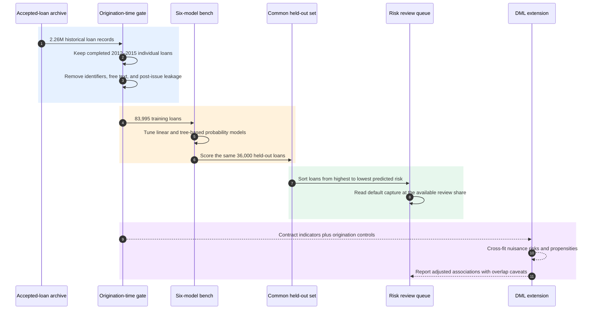

# Risk at First Sight: LendingClub Default-Risk Prediction and Origination Screening

<div align="center">

**Leakage-aware credit scoring that turns default probabilities into a finite review queue**

[](https://www.r-project.org/)
[](#data-provenance-and-cohort-construction)
[](#data-provenance-and-cohort-construction)
[](#predictive-model-bench)
[](#probability-ranking-and-screening-metrics)
[](#screening-as-a-decision-problem)
[](#double-machine-learning-extension)
[](LICENSE)

**[Read the final report](report/risk-at-first-sight-report.pdf)** · **[Inspect the complete R pipeline](src/risk_at_first_sight.R)** · **[Prepare and verify the raw data](data/README.md)**

Original academic project title: **Risk at First Sight**

</div>

**Risk at First Sight** builds a complete historical credit-screening experiment: define a completed-loan cohort, freeze the information set at origination, compare six statistical and tree-based classifiers on one common held-out set, and convert predicted default risk into an ordered review policy. A separate Double Machine Learning branch studies adjusted associations for loan maturity and high interest rates without presenting them as clean causal effects.

The project spans **credit-risk modelling, cohort engineering, outcome harmonization, right-censoring control, leakage prevention, median imputation, categorical level management, one-hot encoding, logistic regression, elastic-net regularization, CART, bootstrap aggregation, out-of-bag evaluation, random forests, ROC and precision–recall analysis, Brier scores, cumulative gains, lift, cross-fitting, nuisance models, residualization, overlap diagnostics, and reproducible R engineering**. This README is the navigation and technical layer; the [final report](report/risk-at-first-sight-report.pdf) contains the complete literature review, derivations, figures, tables, bibliography, and submitted implementation appendix.

## Contents

- [Project at a glance](#project-at-a-glance)
- [Research question](#research-question)
- [The screening desk](#the-screening-desk)
- [Data provenance and cohort construction](#data-provenance-and-cohort-construction)
- [Leakage-aware feature design](#leakage-aware-feature-design)
- [Predictive model bench](#predictive-model-bench)
- [Probability, ranking, and screening metrics](#probability-ranking-and-screening-metrics)
- [Screening as a decision problem](#screening-as-a-decision-problem)
- [Double Machine Learning extension](#double-machine-learning-extension)
- [Key findings](#key-findings)
- [Technical index](#technical-index)
- [Report and repository map](#report-and-repository-map)
- [Run locally](#run-locally)
- [Sources and methodological references](#sources-and-methodological-references)
- [Scope and interpretation](#scope-and-interpretation)
- [License](#license)

## Project at a glance

| Dimension | Project design |
|---|---|
| Decision problem | Rank accepted applications by future completed-loan default risk |
| Source artifact | LendingClub accepted-loan export covering 2007–2018 |
| Raw scale | 2,260,701 records and 151 columns |
| Cohort | 786,818 completed individual loans issued in 2012–2015 |
| Modelling sample | Stratified sample of 119,995 loans |
| Holdout design | 83,995 training loans and 36,000 test loans |
| Classifiers | Logistic regression, elastic net, CART, custom bagging, `ipred` bagging, random forest |
| Evaluation | Accuracy, ROC-AUC, precision–recall, Brier score, OOB diagnostics, cumulative gains, lift |
| Operational layer | Review the highest predicted-risk share first under a finite screening budget |
| Econometric extension | Five-fold cross-fitted partially linear DML for maturity and high interest |
| Implementation | R, tidyverse, `glmnet`, `rpart`, `ipred`, `ranger`, `pROC`, `ggplot2`, `patchwork` |

The central contribution is the connection between **information timing**, **probability estimation**, and **review capacity**. A classifier matters here because it places eventual defaults near the front of a queue, not because it crosses one arbitrary label threshold.

## Research question

How well can future default be predicted at loan origination using borrower and contract characteristics, and what does that predictive signal imply for risk-screening decisions?

For loan $i$, let $Y_i=1$ denote completed-loan default and let $X_i$ contain only information observable when the loan is issued. The target score is

```math
p_i = \Pr(Y_i=1\mid X_i).
```

This apparently simple target creates three design constraints:

1. variables generated by payments, collections, recoveries, and servicing must not enter an origination-time model;
2. the default class is a minority, so raw accuracy alone can conceal weak discrimination;
3. operational usefulness depends on ranking quality at a chosen review capacity, not only classification at threshold 0.5.

## The screening desk



The solid path is the predictive screening study. The dashed branch is a separate econometric extension; it does not alter the held-out classifier comparison or turn the repository into a production underwriting system.

## Data provenance and cohort construction

The exact raw artifact comes from the public [LendingClub loan-data mirror on Kaggle](https://www.kaggle.com/datasets/wordsforthewise/lending-club/data). The local CSV has 2,260,701 data rows and 151 columns and is excluded from Git because it is approximately 1.56 GiB and contains high-dimensional borrower records. [`data/README.md`](data/README.md) records its expected path, byte size, schema dimensions, SHA-256 checksum, redistribution boundary, and verification command.

For provenance context, a [Hong Kong Institute for Monetary and Financial Research paper hosted by the Bank for International Settlements](https://www.bis.org/events/confresearchnetwork1909/lam.pdf#page=3) independently describes LendingClub's funded-listing files as 2,260,701 records from June 2007 through December 2018. The [2014 LendingClub S-1 filing in SEC EDGAR](https://www.sec.gov/Archives/edgar/data/1409970/000119312514323136/d766811ds1.htm) supplies primary historical context on the platform. The Kaggle artifact remains the executable source used in this repository.

### Cohort funnel

| Gate | Rows retained | Why it exists |
|---|---:|---|
| Raw accepted-loan file | 2,260,701 | Preserve the complete historical source artifact |
| Valid issue year and harmonized status | 2,260,668 | Construct calendar time and a coherent performance label |
| Completed 2012–2015 individual loans | 786,818 | Reduce unresolved-outcome censoring and exclude joint applications |
| Stratified working sample | 119,995 | Preserve year-by-default composition within local compute limits |
| Fixed training partition | 83,995 | Fit preprocessing, tuning, and all estimators |
| Fixed test partition | 36,000 | Compare every predictive model on identical observations |

The stratified sample is drawn within issue-year and default cells. The 70/30 train-test split is then stratified by outcome. Full row and column transitions appear in Report Appendix Table 4, [PDF page 12](report/risk-at-first-sight-report.pdf#page=12).

## Leakage-aware feature design

The feasible predictor set satisfies

```math
X_i \subseteq \mathcal{I}_{i,\mathrm{origination}},
```

where $\mathcal{I}_{i,\mathrm{origination}}$ denotes what could be known at the screening moment. Retained fields cover platform credit grade and FICO information, requested amount, income and debt-to-income measures, employment and home-ownership categories, loan purpose, maturity, and pricing.

The pipeline excludes direct identifiers, URLs and free text, post-origination payments, outstanding balances, recoveries, collection outcomes, and other servicing variables that reveal realized performance. This changes the task from retrospective reconstruction to prospective historical prediction.

Preprocessing is learned from training data:

- numeric missing values receive training-sample medians;
- categorical missing or unseen values map to an explicit `Unknown` level;
- training and test factors share one level system;
- `model.matrix` creates aligned one-hot encoded designs;
- `glmnet` standardizes its design internally;
- assertions check binary outcomes, missingness, and identical train-test columns.

The full variable-removal and transformation logic is in [`src/risk_at_first_sight.R`](src/risk_at_first_sight.R).

## Predictive model bench

| Model | Representation and tuning | Nonlinearity | Internal diagnostic |
|---|---|:---:|---|
| Logistic regression | Unpenalized Bernoulli GLM | No | Convergence assertion |
| Elastic net | Five alpha values; five-fold CV selects lambda by deviance | No | Shared CV folds across alpha values |
| CART | Grown tree, CV-selected complexity parameter, pruning with stump safeguard | Yes | Cross-validation error table |
| Custom bagging | 80 bootstrap `rpart` trees coded directly | Yes | OOB probabilities and error path |
| `ipred` bagging | 80 bootstrap trees | Yes | Package OOB error |
| Random forest | 300 probability trees with predictor subsampling | Yes | OOB prediction error and impurity importance |

### Logistic and elastic-net probabilities

The baseline probability model is

```math
\widehat{p}_i
=
\frac{1}{1+e^{-(\beta_0+x_i^{\top}\beta)}}.
```

The elastic-net estimator minimizes average Bernoulli loss plus mixed sparsity and shrinkage penalties:

```math
\min_{\beta_0,\beta}
\Biggl\{
-\frac{1}{n}
\sum_{i=1}^{n}
\Bigl[
y_i\log(\widehat{p}_i)
+
(1-y_i)\log(1-\widehat{p}_i)
\Bigr]
+
\lambda
\Bigl[
\alpha\Vert\beta\Vert_1
+
\frac{1-\alpha}{2}\Vert\beta\Vert_2^2
\Bigr]
\Biggr\}.
```

The alpha grid $\lbrace 0,0.25,0.5,0.75,1\rbrace$ spans ridge through lasso. The $\ell_1$ term permits sparse solutions; the $\ell_2$ term stabilizes correlated credit variables.

### Trees and ensembles

For a classification-tree node with estimated class shares $\widehat{\pi}_0$ and $\widehat{\pi}_1$, Gini impurity is

```math
G=1-\widehat{\pi}_0^2-\widehat{\pi}_1^2.
```

Bagging averages probability predictions over $B$ bootstrap trees:

```math
\widehat{p}_{\mathrm{bag}}(x)
=
\frac{1}{B}
\sum_{b=1}^{B}
\widehat{p}^{*}_b(x).
```

An observation's OOB prediction averages only trees for which that observation was absent from the bootstrap sample. Random forests add predictor subsampling at every split, reducing correlation among the trees.

The complete definitions and tuning logic are in Report Section 3, [PDF pages 3–6](report/risk-at-first-sight-report.pdf#page=3).

## Probability, ranking, and screening metrics

Every classifier produces probabilities for the same 36,000-loan test set. The Brier score measures squared probability error:

```math
\mathrm{Brier}
=
\frac{1}{n_{\mathrm{test}}}
\sum_{i\in\mathcal{T}}
(y_i-\widehat{p}_i)^2.
```

At score threshold $t$, the ROC coordinates are

```math
\begin{aligned}
\mathrm{TPR}(t) &= \frac{\mathrm{TP}(t)}{\mathrm{TP}(t)+\mathrm{FN}(t)}, \\
\mathrm{FPR}(t) &= \frac{\mathrm{FP}(t)}{\mathrm{FP}(t)+\mathrm{TN}(t)}.
\end{aligned}
```

Precision–recall analysis makes the minority default class explicit: recall is the share of defaults detected, while precision is the observed default share among flagged loans. ROC-AUC summarizes pairwise ranking across thresholds; accuracy at 0.5 is retained only as one familiar reference point.

## Screening as a decision problem

Sort the test loans by decreasing $\widehat{p}_i$. If $\mathrm{Top}(q)$ is the highest-risk share $q$ of that ordering, cumulative gain is

```math
\mathrm{Gain}(q)
=
\frac{
\sum_{i\in\mathrm{Top}(q)} y_i
}{
\sum_{i\in\mathcal{T}} y_i
},
\qquad
\mathrm{Lift}(q)=\frac{\mathrm{Gain}(q)}{q}.
```

<table>
<tr>
<td align="center"><strong>1 · SCORE</strong><br>Estimate completed-loan default probability</td>
<td align="center"><strong>2 · SORT</strong><br>Order applications from highest to lowest risk</td>
<td align="center"><strong>3 · SCREEN</strong><br>Choose review capacity and read captured defaults</td>
</tr>
</table>

> [!TIP]
> **The review budget is part of the model's meaning.** A 20% screening share asks a different operational question from a 50% share. Gains and lift expose that trade-off directly instead of hiding it behind one class label.

## Double Machine Learning extension

The separate econometric branch studies two binary contract indicators: 60-month rather than 36-month maturity, and an interest rate at or above the training sample's 75th percentile. The partially linear representation is

```math
\begin{aligned}
Y_i &= \theta_0D_i+g_0(X_i)+\varepsilon_i, \\
D_i &= m_0(X_i)+v_i.
\end{aligned}
```

Five-fold cross-fitting predicts each observation with nuisance models trained without that observation:

```math
\widetilde{Y}_i
=
Y_i-\widehat{g}^{(-k(i))}(X_i),
\qquad
\widetilde{D}_i
=
D_i-\widehat{m}^{(-k(i))}(X_i).
```

The residual-on-residual slope is

```math
\widehat{\theta}_{\mathrm{DML}}
=
\frac{
\sum_{i=1}^{n}\widetilde{D}_i\widetilde{Y}_i
}{
\sum_{i=1}^{n}\widetilde{D}_i^2
}.
```

Elastic-net logistic nuisance models estimate outcome risk and treatment propensity. Cross-fitting and orthogonalization reduce first-stage regularization bias; they do not repair weak overlap or unobserved confounding. The resulting quantities are therefore described as adjusted associations. See Report Section 3, [PDF page 6](report/risk-at-first-sight-report.pdf#page=6).

## Key findings

### Held-out predictive performance

| Model | Accuracy | ROC-AUC | Brier score |
|---|---:|---:|---:|
| Logistic regression | **0.818** | **0.727** | **0.135** |
| Elastic net | **0.818** | **0.727** | **0.135** |
| Random forest | **0.818** | 0.725 | 0.136 |
| `ipred` bagging | 0.817 | 0.704 | 0.152 |
| Custom bagging | 0.817 | 0.690 | 0.138 |
| CART | 0.816 | 0.666 | 0.140 |

The result is deliberately not a complexity victory. Logistic regression and elastic net match the strongest held-out discrimination and probability error; the random forest is close, while the additional ensembles deliver limited incremental value after leakage-aware feature construction.

### Screening result

- reviewing roughly the highest-risk 20–30% of test loans captures about half of all observed defaults;
- random review would capture only 20–30% at the same capacity;
- logistic regression, elastic net, and random forest dominate the weaker tree variants across much of the ranking range;
- custom-bagging OOB error stabilizes as the ensemble grows, supporting the direct implementation check.

### Contract comparisons

| Contract comparison | Naive difference | DML-adjusted estimate | Reported 95% interval |
|---|---:|---:|---:|
| 60-month vs. 36-month term | +18.28 pp | +67.69 pp | [-343.62, 479.01] pp |
| High vs. lower interest rate | +18.19 pp | +1.74 pp | [-4.87, 8.34] pp |

The maturity estimate is not substantively identified by this design: residual treatment overlap is too weak, producing an implausibly wide interval. For the high-rate comparison, adjustment removes most of the raw difference and the interval includes zero. Neither supports a clean causal claim.

The table preserves the submitted report values. A complete rerun under the recorded public environment reproduced all six predictive rows exactly and returned DML point estimates of +66.78 pp for maturity and +1.53 pp for high interest, with the same overlap and interval conclusions. [`environment/session-info.txt`](environment/session-info.txt) records that verified package stack.

Full performance tables, ROC and precision–recall curves, gains and lift, score distributions, OOB diagnostics, and DML outputs are in Report Section 4, [PDF pages 6–9](report/risk-at-first-sight-report.pdf#page=6).

## Technical index

| Layer | Techniques and concepts implemented |
|---|---|
| Cohort engineering | Status harmonization, completed-outcome restriction, censoring control, individual-application filtering, stratified downsampling |
| Leakage control | Decision-time information set, identifier and text removal, servicing-field exclusion, outcome-aware feature audit |
| Preprocessing | Training-only median imputation, explicit unknown categories, factor-level alignment, one-hot encoding, standardization |
| Linear models | Bernoulli GLM, log-odds, elastic net, ridge-to-lasso alpha grid, coordinate-descent paths, five-fold CV deviance |
| Tree models | CART, Gini impurity, complexity pruning, bootstrap aggregation, soft voting, random feature selection |
| Ensemble diagnostics | Direct 80-tree bagger, `ipred` benchmark, 300-tree probability forest, OOB probabilities, OOB error path |
| Predictive evaluation | Accuracy, confusion matrices, ROC curves, AUC, precision–recall curves, Brier score, score distributions |
| Decision evaluation | Risk ordering, cumulative gains, lift, review capacity, default capture |
| Econometrics | Partially linear model, elastic-net nuisance functions, cross-fitting, residualization, orthogonal score intuition, overlap diagnostics |
| Software | R, `readr`, `dplyr`, `tidyr`, `stringr`, `forcats`, `glmnet`, `rpart`, `ipred`, `ranger`, `pROC`, `ggplot2`, Make |

## Report and repository map

| Question or artifact | Best destination |
|---|---|
| Motivation and screening question | Report Section 1, [PDF page 2](report/risk-at-first-sight-report.pdf#page=2) |
| Cohort, variables, and descriptives | Report Section 2, [PDF pages 2–3](report/risk-at-first-sight-report.pdf#page=2) |
| Predictive-model mathematics | Report Section 3, [PDF pages 3–6](report/risk-at-first-sight-report.pdf#page=3) |
| Test performance and screening curves | Report Section 4, [PDF pages 6–8](report/risk-at-first-sight-report.pdf#page=6) |
| DML design and interpretation | Report Sections 3–4, [PDF pages 6 and 8–9](report/risk-at-first-sight-report.pdf#page=6) |
| Conclusion | Report Section 5, [PDF page 9](report/risk-at-first-sight-report.pdf#page=9) |
| Bibliography and figure appendix | [PDF pages 10–11](report/risk-at-first-sight-report.pdf#page=10) |
| Data-preparation audit table | [PDF page 12](report/risk-at-first-sight-report.pdf#page=12) |
| Complete submitted implementation | [PDF pages 12–62](report/risk-at-first-sight-report.pdf#page=12) |
| Curated executable pipeline | [`src/risk_at_first_sight.R`](src/risk_at_first_sight.R) |
| Raw-data acquisition contract | [`data/README.md`](data/README.md) |
| Verified public package stack | [`environment/session-info.txt`](environment/session-info.txt) |

## Run locally

```bash
git clone https://github.com/SadraDaneshvar/lendingclub-default-risk-screening.git
cd lendingclub-default-risk-screening
make setup
```

Download the accepted-loan archive described in [`data/README.md`](data/README.md), extract it to

```text
data/accepted_2007_to_2018Q4.csv
```

and verify the exact artifact before fitting:

```bash
make verify-data
make run
```

Generated plots and LaTeX tables are written under `results/` and remain untracked. The 1.56 GiB import, repeated tree ensembles, and cross-fitted nuisance models require substantial memory and compute time. The report preserves the complete submitted outputs so the research can be inspected without rerunning every estimator.

## Sources and methodological references

- **Executable data mirror:** [All Lending Club loan data on Kaggle](https://www.kaggle.com/datasets/wordsforthewise/lending-club/data), with exact local integrity metadata in [`data/README.md`](data/README.md).
- **Historical export corroboration:** F. Y. Eric Lam, [*Funding Decision in Online Marketplace Lending*](https://www.bis.org/events/confresearchnetwork1909/lam.pdf#page=3), hosted by the Bank for International Settlements.
- **Primary platform context:** LendingClub Corporation, [2014 Form S-1 registration statement](https://www.sec.gov/Archives/edgar/data/1409970/000119312514323136/d766811ds1.htm), U.S. Securities and Exchange Commission.
- **Elastic-net computation:** Friedman, Hastie, and Tibshirani, [*Regularization Paths for Generalized Linear Models via Coordinate Descent*](https://www.jstatsoft.org/article/view/v033i01), *Journal of Statistical Software* 33(1).
- **Double Machine Learning:** Chernozhukov and coauthors, [*Double/debiased machine learning for treatment and structural parameters*](https://doi.org/10.1111/ectj.12097), *The Econometrics Journal* 21(1).

The final report contains the complete credit-risk and P2P-lending bibliography used to motivate the design.

## Scope and interpretation

- The source contains accepted LendingClub loans, not the full applicant pool; conclusions concern ranking within the observed platform population.
- Completed 2012–2015 outcomes reduce censoring but define a historical cohort rather than a current deployment distribution.
- The random split measures interpolation within that cohort, not performance after 2015.
- AUC, Brier score, precision–recall, gains, and lift are more informative here than accuracy alone.
- No protected-group fairness analysis, policy validation, or production monitoring is performed.
- DML results depend on overlap and conditional-identification assumptions; the maturity diagnostic shows where those assumptions fail in practice.

## License

This project is released under the [MIT License](LICENSE). Citation metadata is provided in [`CITATION.cff`](CITATION.cff).

The repository is an academic analysis and does not provide lending, underwriting, investment, legal, or regulatory advice. The MIT license covers original code and documentation, not the third-party LendingClub records.
